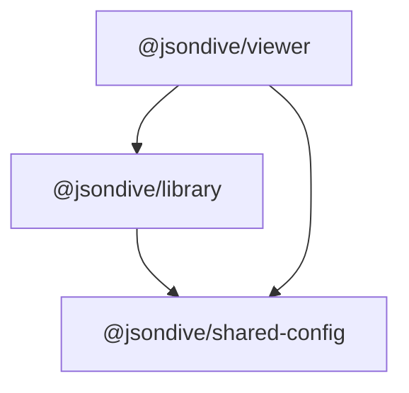

## License

This software is **free for non-commercial use only**.

Commercial use requires a paid license.

See [`LICENSE.txt`](./LICENSE.txt) for full terms.

To purchase a commercial license, contact: [bill@jsondive.app](mailto:bill@jsondive.app).

## Packages

| Package                                                                       | Description                                                                                                   |
| ----------------------------------------------------------------------------- | ------------------------------------------------------------------------------------------------------------- |
| [`@jsondive/viewer`](http://npmjs.com/package/@jsondive/viewer)               | The main viewer component. This is what you will use.                                                         |
| [`@jsondive/library`](http://npmjs.com/package/@jsondive/library)             | Functions, utilities, and the design system used by both the viewer and [jsondive.app](https://jsondive.app). |
| [`@jsondive/shared-config`](http://npmjs.com/package/@jsondive/shared-config) | Shared TypeScript and ESLint config.                                                                          |

