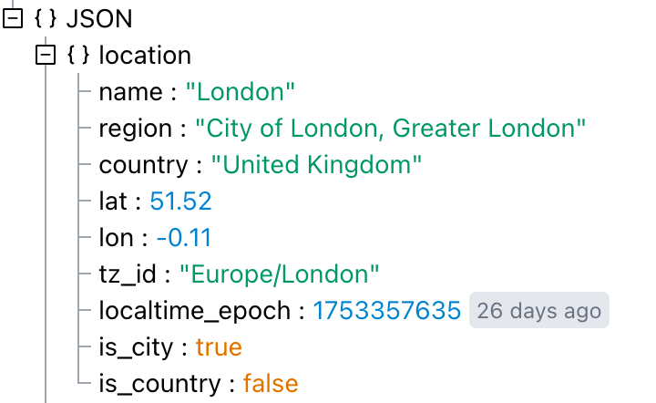
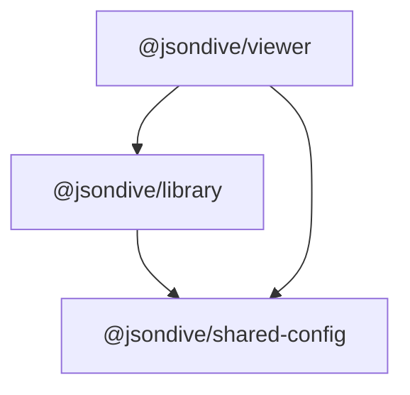

<div align="center">
    <h1>JSON Dive Viewer</h1>
    <p>A powerful React component for exploring and visualizing JSON data</p>
    <p>
        <a href="https://docs.jsondive.app/developer/">Documentation</a>
    </p>
    <p>
        <a href="https://www.npmjs.com/package/@jsondive/viewer"></a>
    </p>
    
</div>

# Install

```sh
npm install @jsondive/viewer
```

See [the documentation](https://docs.jsondive.app/developer/) for usage instructions.

# About

This is a re-usable JSON viewer component that's used by [jsondive.app](https://jsondive.app), a powerful online JSON viewer.

See the [hello-jsondive](https://github.com/jsondive/hello-jsondive) project for an example of usage in a Vite project.

# License

This software is **free for non-commercial use only**.

Commercial use requires a paid license.

See [`LICENSE.txt`](./LICENSE.txt) for full terms.

To purchase a commercial license, contact: [bill@jsondive.app](mailto:bill@jsondive.app).

# Packages

| Package                                                                       | Description                                                                                                   |
| ----------------------------------------------------------------------------- | ------------------------------------------------------------------------------------------------------------- |
| [`@jsondive/viewer`](http://npmjs.com/package/@jsondive/viewer)               | The main viewer component. This is what you will use.                                                         |
| [`@jsondive/library`](http://npmjs.com/package/@jsondive/library)             | Functions, utilities, and the design system used by both the viewer and [jsondive.app](https://jsondive.app). |
| [`@jsondive/shared-config`](http://npmjs.com/package/@jsondive/shared-config) | Shared TypeScript and ESLint config.                                                                          |



## Packaging tasks

See [Intro to using Changesets](https://github.com/changesets/changesets/blob/main/docs/intro-to-using-changesets.md) for more information.

### Add a changeset

```
npx @changeset/cli add
```

### Increment semver

```
npx @changeset/cli version
```

### Publish packages

```
npx @changeset/cli publish
```
